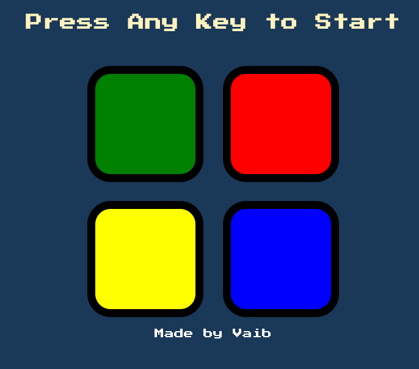
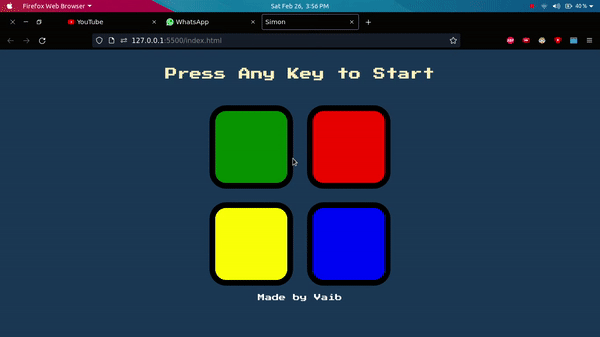

# Simon

This is a very addictive memory game made using JavaScript.

## Rules to play the game:
1. Begin the game by pressing any key on keyboard.
2. You will see a random button flash.
3. Click on it.
4. You will see another button flash.
5. Click on the previous button and then click on this button.
6. This will continue till you click on wrong button.

## Benefits of this Game:
* This game helps in boosting brain memorising power.
* This game is very simple and fun to play that everyone can play it.

## How to play?
See this demo video:

## Author
Vaibhav Kumar Singh
